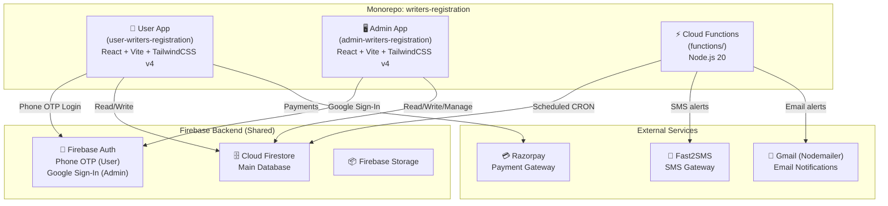
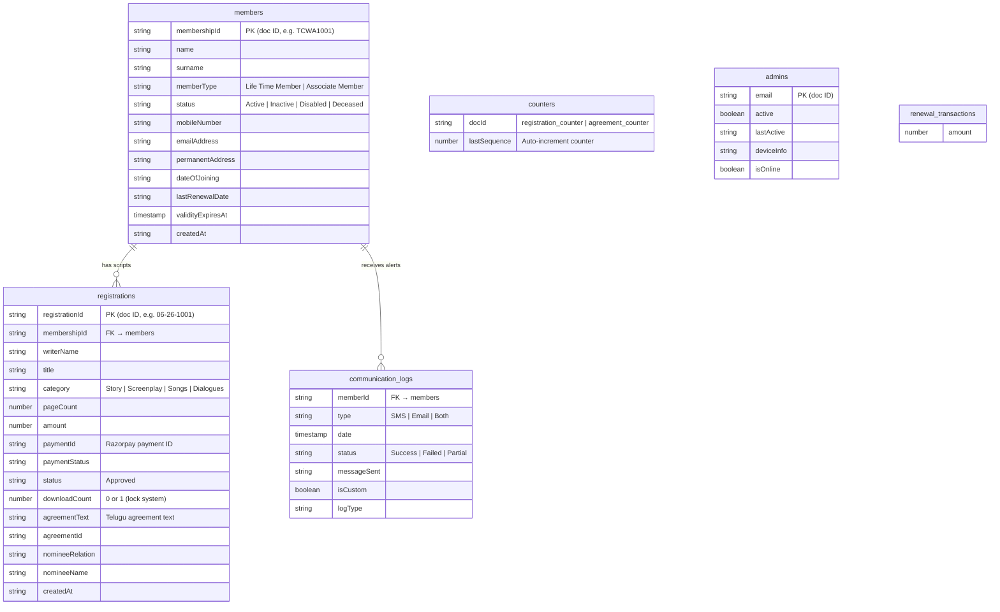
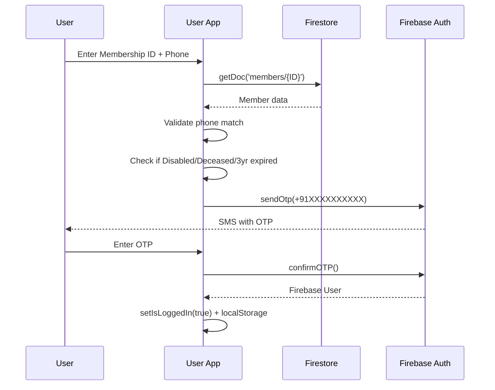
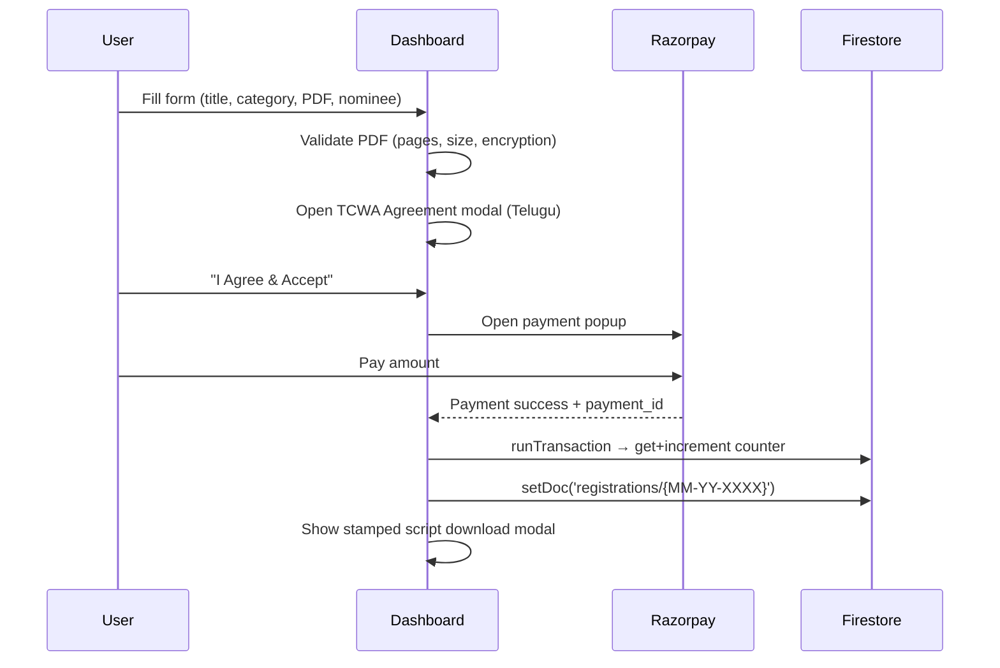
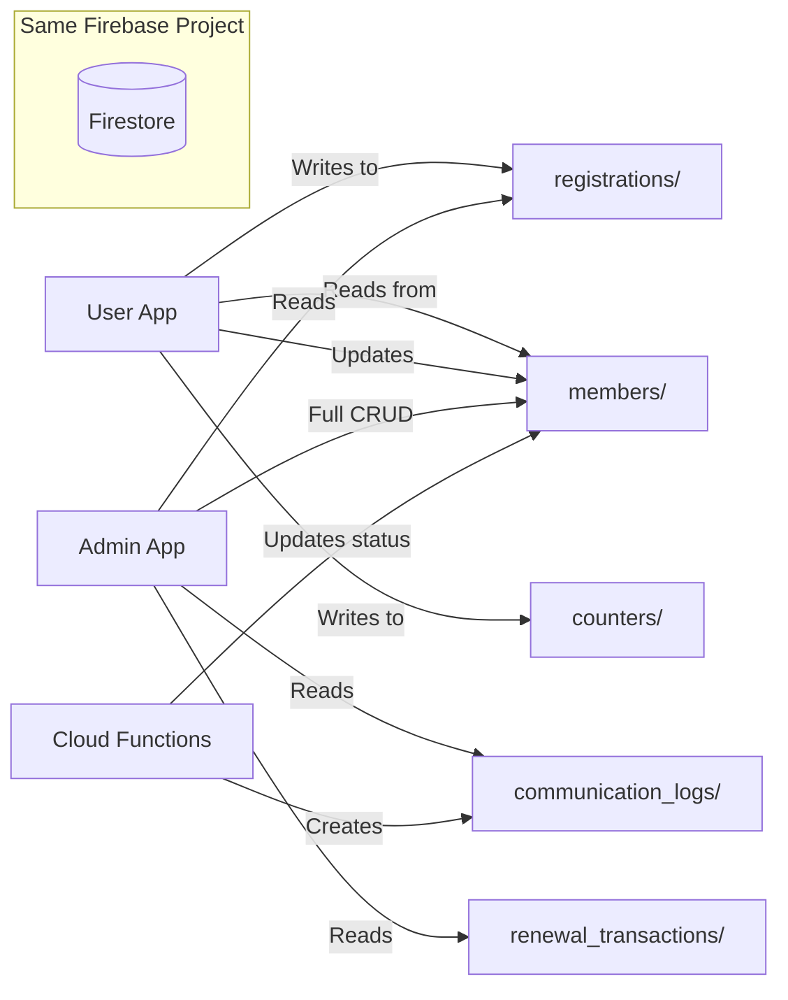

# TCWA Writers Registration — Complete Project Analysis

## 🏗️ Architecture Overview

This project is a **monorepo** containing **3 independent sub-projects** that all connect to the **same Firebase project** (shared Firestore database):



---

## 📂 Directory Structure

```
writers-registration/
├── firebase.json                    # Firebase config (Cloud Functions only)
├── PROJECT_SOP.md                   # Business requirements (Tanglish)
├── demo_members.txt                 # Sample member data
│
├── user-writers-registration/       # 📱 USER-FACING APP
│   ├── src/
│   │   ├── App.jsx                  # Router, auth guard, session management
│   │   ├── firebase.js              # Firebase SDK init + callable functions
│   │   ├── main.jsx                 # Entry point
│   │   ├── lib/utils.js             # Razorpay loader + title normalizer
│   │   ├── pages/
│   │   │   ├── Login.jsx            # Phone + Membership ID login
│   │   │   ├── Dashboard.jsx        # Main single-page dashboard (1337 lines!)
│   │   │   ├── PrivacyPolicy.jsx
│   │   │   └── TermsOfUse.jsx
│   │   └── components/
│   │       ├── Header.jsx, Footer.jsx, SupportModal.jsx
│   │       └── dashboard/
│   │           ├── DashboardHeader.jsx
│   │           ├── ProfileCard.jsx
│   │           ├── RegistrationForm.jsx
│   │           ├── ReceiptSidebar.jsx
│   │           ├── RegistrationsTable.jsx
│   │           └── ReceiptModal.jsx
│   └── public/
│       ├── Logo.png, stamp.png, signature.png, officialstamptext.png
│       └── pdf.worker.min.mjs
│
├── admin-writers-registration/      # 🖥️ ADMIN DASHBOARD APP
│   ├── src/
│   │   ├── App.jsx                  # Router, Google auth, admin verification
│   │   ├── firebase.js              # Firebase SDK + callable functions
│   │   ├── pages/
│   │   │   ├── AdminLoginPage.jsx
│   │   │   ├── DashboardHomePage.jsx    # Stats overview
│   │   │   ├── members/MembersPage.jsx  # Member management (77KB!)
│   │   │   ├── registrations/RegistrationsPage.jsx
│   │   │   ├── renewals/RenewalsPage.jsx
│   │   │   ├── notifications/NotificationsPage.jsx
│   │   │   ├── communication-logs/CommunicationLogsPage.jsx
│   │   │   └── reports/ReportsPage.jsx
│   │   ├── layouts/ (DashboardLayout, AsideLayout, MobileNav)
│   │   └── components/ (ProtectedRoute, Skeletons, Header, etc.)
│   └── public/
│
└── functions/                       # ⚡ FIREBASE CLOUD FUNCTIONS
    ├── index.js                     # 3 exported functions
    └── package.json
```

---

## 🗄️ Firestore Database Schema

Both apps read/write to the **same Firestore database**. Here are the collections:



---

## 📱 User App — How It Works

### Authentication Flow


> [!IMPORTANT]
> **Strict login** — Membership ID must exist in `members` collection AND phone number must match exactly. No self-registration.

### Session Management
- **6-day session limit** — Auto-logout after 6 days via localStorage timestamp
- **Firebase Auth state listener** — If Firebase Auth session drops, force logout
- **Real-time Firestore listener** — If member document deleted/disabled, force logout
- **Auto-status updates** — If expired >3 years → auto-set "Disabled"; if expired → auto-set "Inactive"

### Script Registration Flow


### Pricing Logic
| Category | Calculation |
|----------|-------------|
| Songs (1 page) | Flat ₹200 |
| All others | `Math.ceil(pageCount / 25) × ₹300` |

### PDF Stamping (Client-side)
- Uses **pdf-lib** to modify the uploaded PDF directly in browser
- Adds on every page: TCWA watermark, border, header text, stamp image, signature image, official seal text
- **One-time download** — After download, `downloadCount` set to 1, button locks
- **Re-download** — Requires full Razorpay payment again to reset `downloadCount` to 0

---

## 🖥️ Admin App — How It Works

### Authentication Flow
- **Google Sign-In** via Firebase Auth popup
- Admin verification: checks email against `VITE_ADMIN_EMAILS` env var OR `admins` collection in Firestore
- **24-hour session limit** (stricter than user app)
- **Real-time admin revocation** — If `admins/{email}` deleted or `active: false`, instant logout
- Tracks `lastActive`, `deviceInfo`, `isOnline` in `admins` collection

### Admin Dashboard Pages

| Page | Firestore Collections Used | Purpose |
|------|---------------------------|---------|
| **Dashboard Home** | `members`, `registrations`, `renewal_transactions` | Stats overview (total members, scripts, revenue, pending renewals) |
| **Members** | `members` | Full CRUD — view, add, edit, upgrade to Life Member, mark Deceased/Disabled, bulk import via Excel |
| **Registrations** | `registrations` | View all script registrations, see payment details (NO access to actual PDF files) |
| **Renewals** | `members`, `renewal_transactions` | Manage yearly renewals for Associate members |
| **Notifications** | `members`, `communication_logs` | Send custom SMS/Email to individual members via Cloud Functions |
| **Communication Logs** | `communication_logs` | View all sent SMS/Email history |
| **Reports** | `members`, `registrations`, `renewal_transactions` | Analytics & financial reports |

### Admin Callable Functions (via Cloud Functions)
The admin app references these Cloud Functions:
- `importMembers` — Bulk import members
- `renewAssociateMember` — Process renewal
- `upgradeToLifeMember` — Convert Associate → Life
- `setMemberInactive` — Deactivate member
- `getCommunicationBalances` — Check Fast2SMS wallet balance
- `sendCustomMessage` — Send custom SMS/Email to members

> [!NOTE]
> Only `dailyRenewalCheck`, `getCommunicationBalances`, and `sendCustomMessage` are defined in the current `functions/index.js`. The other callable functions (`importMembers`, `renewAssociateMember`, etc.) referenced by the admin firebase.js are likely deployed separately or still in development.

---

## ⚡ Cloud Functions — Backend Logic

### 1. `dailyRenewalCheck` (Scheduled — every day 9:00 AM)
```
For each Associate Member in Firestore:
  ├── 7 days before expiry → Send reminder SMS + Email
  ├── Expiry day → Set status "Inactive" + Send notice
  ├── 2 years overdue → Send ₹500 penalty reminder
  ├── 3 years overdue → Send ₹1000 penalty reminder
  └── 3+ years overdue → Set status "Disabled" + disabled=true
```

### 2. `getCommunicationBalances` (Callable — Admin only)
- Checks Fast2SMS wallet balance
- Returns SMS balance + "Unlimited" for email

### 3. `sendCustomMessage` (Callable — Admin only)
- Sends SMS via Fast2SMS Quick SMS API
- Sends Email via Gmail/Nodemailer
- Logs everything to `communication_logs` collection

---

## 🔗 How Both Apps Connect — The Bridge



### Key Connection Points:

| Firestore Collection | User App | Admin App | Cloud Functions |
|---------------------|----------|-----------|-----------------|
| `members` | **Read** (login) + **Write** (auto-status) | **Full CRUD** | **Read** + **Write** (status updates) |
| `registrations` | **Create** (new scripts) | **Read** (view only) | — |
| `counters` | **Read/Write** (increment) | — | — |
| `admins` | — | **Read** (auth check) + **Write** (activity) | **Read** (permission check) |
| `communication_logs` | — | **Read** (view logs) | **Create** (log entries) |
| `renewal_transactions` | — | **Read** (revenue calc) | — |

---

## 🔒 Privacy & Security Model

> [!CAUTION]
> **100% Script Privacy** — The user's uploaded PDF is NEVER stored in Firebase Storage or anywhere on the server. It's processed entirely client-side:
> 1. User uploads PDF → browser reads it via `pdf-lib` + `pdfjs-dist`
> 2. Page count calculated in browser
> 3. After payment, stamps/watermarks are applied client-side
> 4. Stamped PDF downloaded directly to user's device
> 5. **Admin can NEVER read the script** — only sees metadata (title, pages, amount, payment ID)

### Auth Security Summary:
| Feature | User App | Admin App |
|---------|----------|-----------|
| Login method | Phone OTP | Google Sign-In |
| Session timeout | 6 days | 24 hours |
| Pre-approved list | `members` collection | `admins` collection + env var |
| Real-time revocation | ✅ Firestore listener | ✅ Firestore listener |
| Auto-disable | 3+ years expired | Admin doc deleted/deactivated |

---

## 🛠️ Tech Stack Summary

| Layer | User App | Admin App | Backend |
|-------|----------|-----------|---------|
| **Framework** | React 19 + Vite 8 | React 19 + Vite 8 | Node.js 20 |
| **Styling** | TailwindCSS v4 | TailwindCSS v4 | — |
| **Icons** | lucide-react | lucide-react + react-icons | — |
| **Auth** | Firebase Phone Auth | Firebase Google Auth | firebase-admin |
| **Database** | Firestore (client SDK) | Firestore (client SDK) | Firestore (admin SDK) |
| **PDF** | pdf-lib + pdfjs-dist + jsPDF | jsPDF + html2canvas | — |
| **Payments** | Razorpay client-side | — | — |
| **SMS** | — | — | Fast2SMS API (axios) |
| **Email** | — | — | Gmail via Nodemailer |
| **Excel** | — | xlsx (SheetJS) | — |
| **Hosting** | Vercel | Vercel | Firebase Cloud Functions |
| **Routing** | react-router-dom v7 | react-router-dom v7 | — |
| **Notifications** | react-toastify | react-toastify | — |
